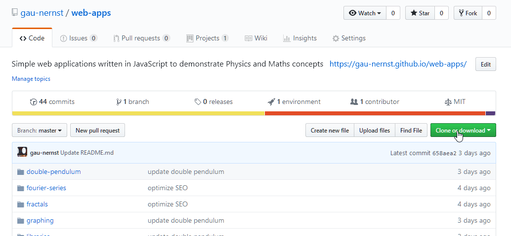

Web apps (https://gau-nernst.github.io/web-apps/)
==================

<div>
    
    
    
</div>

# Description

I write small applications that run directly in web browsers. Most of them are simple physics simulations and topics that I am intersted in.

This site is written in HTML, CSS and JavaScript.

## List of apps

<h2>Featured</h2>
<ul>
    <li><a href="https://gau-nernst.github.io/web-apps/double-pendulum/">Double pendulum</a></li>
    <li><a href="https://gau-nernst.github.io/web-apps/oscillator/">Harmonic oscillator</a></li>
</ul>
<h2>Others</h2>
<ul>
    <li><a href="https://gau-nernst.github.io/web-apps/fractals/">Fractals</a></li>
    <li><a href="https://gau-nernst.github.io/web-apps/lissajous/">Lissajous curves</a></li>
    <li><a href="https://gau-nernst.github.io/web-apps/pendulum/">Pendulum</a></li>
    <li><a href="https://gau-nernst.github.io/web-apps/simple-balls/">Simple balls</a> (Not working as intended)</li>
</ul>
<h2>Under development</h2>
<ul>
    <li><a href="https://gau-nernst.github.io/web-apps/graphing/">Graphing</a></li>                
    <li><a href="https://gau-nernst.github.io/web-apps/wave/">Wave</a></li>
    <li><a href="https://gau-nernst.github.io/web-apps/taylor-series/">Taylor series</a></li>
    <li><a href="https://gau-nernst.github.io/web-apps/fourier-series/">Fourier series</a></li>
    <li><a href="https://gau-nernst.github.io/web-apps/sort/">Sort algorithm visualization</a></li>
</ul>

## Mathematical expressions

All mathematical expressions are written in LaTeX and rendered with [KaTeX](https://github.com/KaTeX/KaTeX). A small script is written to render inline mathematical expressions, which are encapsulated by a single dollar sign symbol `$`.

The inline math render script is located in `/libraries/inlineKatex.js`.

# Installation

These web-apps can be run directly on any modern browser by navigating to https://gau-nernst.github.io/web-apps/.

For offline uses and modifying the code, please click the green 'Clone and download' button, and 'Download as zip'. Otherwise, you can save the web page locally.



There is a special math library named `math.js` located in `\libraries\math.js`. This script contains all the math functions that I use in my code. Feel free to download this script for your own personal use. Documentation is available in the [Wiki](https://github.com/gau-nernst/web-apps/wiki/math.js) section (WIP).

# Usage

Instructions on how to use the web-apps are available on the web interface.

To learn about my `math.js`, please go to the [Wiki](https://github.com/gau-nernst/web-apps/wiki/math.js) section (WIP).

You can try out `math.js` in this hidden Test page [here](https://gau-nernst.github.io/web-apps/test/). The whole module is imported as a namespace, and then linked as a property named `math` of the `window` object. To use it, simply open the Console in your browser of choice and call the `math` object.

```javascript
math.Solver.cubicEqn(1,5,4,3);
// The console will show 'Array [ -4.220692819987324 ]'
```


The gif above shows instructions for Firefox. Opening the console in Edge, Chrome, Safari and other Chromium-based browsers should be similar.

# License

This project is licensed under the MIT License.
